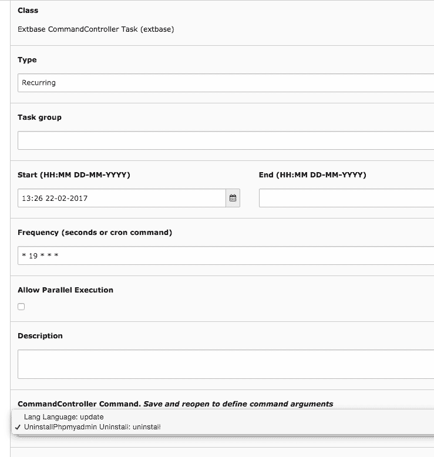

##Uninstall Phpmyadmin

Don't forget to uninstall phpmyadmin in production!!!

Now there is no excuse.

uninstall_phpmyadmin is an Extbase-CommandController-Task to uninstall und remove the extension phpmyadmin.

**Install:**
install the ext: uninstall_phpmyadmin and create a scheduler task.
Choose "Extbase CommandController Task" and as CommandController Command "UninstallPhpmyadmin"

**Scheduler example Config**

run at end of working day und phpmyadmin is gone :)
